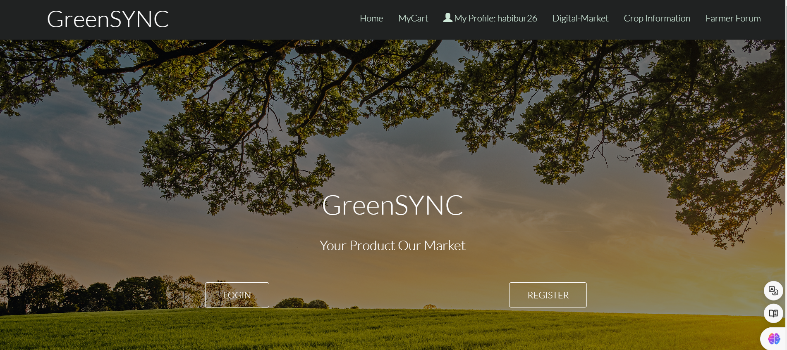

# GreenSYNC

## Project Overview

Our revolutionary agricultural farm tech solution is intended to bring Bangladeshi farming into the modern era. At its core, the platform serves as an Agricultural Information Center, offering farmers a comprehensive suite of tools to navigate the complexities of their profession. Real-time weather updates, crop prices, and agricultural best practices are seamlessly integrated into a user-friendly portal. This not only equips farmers with essential information but also provides a direct marketplace where they can sell their produce. To further improve the platform's usefulness and provide a comprehensive solution for the agricultural community, it also includes a large crop database and educational content on sustainable farming.
## Login And Registation
  1. User Prpfile 
  2. Buyer Profile 
  

    